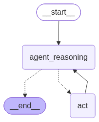

# LangGraph ReAct Agent — Learning POC

A ReAct-style AI agent implemented using LangGraph and LangChain as part of my hands-on learning of Agentic AI.

## Overview

This project demonstrates how an LLM can request tools, execute them through a LangGraph workflow, and use their results to generate responses.

## Key Concepts

- ReAct-style reasoning and tool execution
- LLM tool calling using LangChain
- State management using `MessagesState`
- Conditional workflow routing using `StateGraph`
- Tool execution through `ToolNode`

## Technologies

- Python
- LangGraph
- LangChain
- LLM APIs

## Agent Workflow
The following diagram illustrates the ReAct agent execution flow.

1. The user submits a question.
2. The LLM decides whether to request a tool.
3. If a tool is requested, LangGraph routes execution to the tool node.
4. The tool executes and returns a result.
5. The result is added to the conversation state.
6. The LLM processes the updated state and either requests another tool or generates a final response.

## Learning Reference

This project follows Eden Marco's LangGraph course.

Original project: https://github.com/emarco177/langgraph-course/tree/project/ReAct-agent

The implementation is shared as a personal learning POC, with attribution to the original course author.